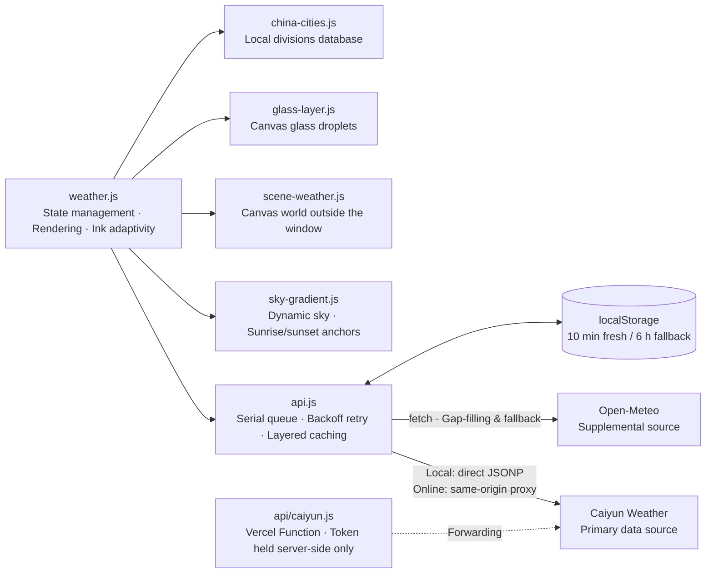

<p align="center"><a href="./README.md">简体中文</a> | <b>English</b></p>

<div align="center">

# AeroWeather

**A weather dashboard driven by Caiyun weather data · Zero build / zero dependency, pure static site**

A "world outside the window" rendered with three Canvas layers — dynamic sky, rain/snow/lightning, and glass droplets, all drawn frame by frame.

[](https://weather.abobb.com)
[](#quick-start)
[](#technical-architecture)

[Live Demo](https://weather.abobb.com) · [Core Features](#core-features) · [A Tour of the Interface](#a-tour-of-the-interface) · [Technical Architecture](#technical-architecture) · [Quick Start](#quick-start)

</div>


---

## Table of Contents

- [Core Features](#core-features)
- [A Tour of the Interface](#a-tour-of-the-interface)
  - [Main Dashboard](#main-dashboard)
  - [Eight Weather Scenes](#eight-weather-scenes)
  - [Convection Playground](#convection-playground)
- [Technical Architecture](#technical-architecture)
  - [Three-Layer Canvas Rendering](#three-layer-canvas-rendering)
  - [Data Source Layering](#data-source-layering)
  - [City Search: Local-First + Online Fallback](#city-search-local-first--online-fallback)
- [Quick Start](#quick-start)
- [Deployment](#deployment)
- [Project Structure](#project-structure)
- [Implementation Notes](#implementation-notes)
- [Changelog](#changelog)

---

## Core Features

| | Feature | Description |
|---|---|---|
| 🌤 | **Real-time weather** | Temperature, feels-like, daily high/low, relative humidity, wind direction & speed (Beaufort scale), precipitation, surface pressure |
| 🌫 | **Air quality** | PM2.5 / PM10 concentrations with the Chinese national standard's grading, plus a six-step gradient scale band from "Excellent" to "Severe"; the cursor picks its color from the gradient line based on position |
| 🕐 | **Hourly & multi-day forecast** | 24-hour temperature curve (ink-adaptive icons); 7-day forecast with proportional temperature-range bars |
| 🎨 | **Three-layer Canvas rendering** | Sky gradient → world outside the window (rain/snow/lightning/haze/stars) → near-field glass droplets; see [below](#three-layer-canvas-rendering) |
| 🌅 | **True sunrise/sunset** | The sky's dawn and dusk segment anchors are bound to the actual sunrise/sunset times of the located place, changing dynamically with location |
| 🏙 | **Nationwide city search** | Built-in administrative divisions database of 34 provinces / 363 cities / 2855 districts & counties (with center coordinates), instant offline results; supports simplified/traditional character variants |
| 🧪 | **Convection Playground** | Standalone page `storm.html`: 8 weather scenes × any time of day, freely combinable, with frozen lightning, particle counts, and a live fps display |
| 🌙 | **Ink adaptivity** | Text and icons automatically switch between light and dark ink based on sky brightness — readable at any hour |
| 📱 | **Responsive** | Adaptive layout for phones / tablets / desktops, one and the same codebase |

## A Tour of the Interface

> All screenshots are taken from the live running version. The main dashboard's sky time is pinned via the built-in debug hook `window.__skyTime(h)`;
> the weather and temperature are that day's real data. The **eight weather scenes** were captured on the
> [Convection Playground](https://weather.abobb.com/storm.html) — the playground and the main site share the same rendering engine
> (`sky-gradient` / `scene-weather` / `glass-layer`). Collapse the control panel and you get a pure weather view, which makes it the most direct source for "what each weather looks like".

### Main Dashboard

**Daytime** — temperature, six live metrics, the 24-hour hourly curve and the 7-day forecast (with proportional temperature-range bars).


**Night** — sky brightness simultaneously drives card opacity, text ink, and droplet lighting; the whole page is recomputed coherently with the hour.


<div align="center">

**Mobile** — the same codebase's adaptive layout at a 390px viewport.


</div>

### Eight Weather Scenes

The sky is modulated by the weather (darkened / desaturated / tinted); precipitation, lightning, and glass droplets are each drawn independently.
All eight shots below are from the same moment (19:00), making the sky-color differences easy to compare side by side:

<table>
  <tr>
    <td align="center" width="50%">
      <br>
      <b>Clear</b> — stars visible, brightest sky
    </td>
    <td align="center" width="50%">
      <br>
      <b>Cloudy</b> — cloud cover lifts, sky darkens and desaturates
    </td>
  </tr>
  <tr>
    <td align="center" width="50%">
      <br>
      <b>Overcast</b> — stars fade out, sky pressed to its heaviest
    </td>
    <td align="center" width="50%">
      <br>
      <b>Fog</b> — haze washes the sky pale, horizon layers turn gray
    </td>
  </tr>
  <tr>
    <td align="center" width="50%">
      <br>
      <b>Drizzle</b> — sparse rain streaks, first droplets appear on the glass
    </td>
    <td align="center" width="50%">
      <br>
      <b>Rain</b> — dense, slanting rain streaks, droplets active
    </td>
  </tr>
  <tr>
    <td align="center" width="50%">
      <br>
      <b>Thunderstorm</b> — densest rain, darkest sky, forked lightning (frozen frame)
    </td>
    <td align="center" width="50%">
      <br>
      <b>Snow</b> — flaky and slow-falling, density on par with rain
    </td>
  </tr>
</table>

### Convection Playground

A standalone page `storm.html`: eight weather scenes × any time of day, freely combinable. The panel on the right shows the scene, particle counts, and real-time fps,
and supports following real time, pausing, **freezing lightning** (after pausing the animation, manually render one frame to leave the forked branches in the picture),
and a glass-droplet layer toggle.


---

## Technical Architecture



The entire frontend consists of **native ES Modules** — no frameworks, no bundlers. The repository root is the deployable artifact.

### Three-Layer Canvas Rendering

The visual system is split into three layers from back to front, each independent and unaware of the others:

| Layer | File | Content |
|---|---|---|
| Sky gradient | `sky-gradient.js` | Full-screen gradient interpolated by hour, modulated by weather (darkened / desaturated / tinted); dawn and dusk segment anchors bound to the location's real sunrise/sunset |
| World outside the window | `scene-weather.js` | Horizon warm-light band, star field, rain/snow particles, lightning (per-frame state machine, forked with three-layer strokes) |
| Glass droplets | `glass-layer.js` | Near-field droplets: wetting rings, lens bodies, highlights, drop shadows, and sliding trails — six-layer structure baked into 24 sprites |

Sky brightness simultaneously drives **ink switching** (`data-ink="light|dark"`) and **droplet lighting** (streetlight-color-temperature compensation at night), so the three layers and the typography always stay in harmony.

### Data Source Layering

| Tier | Source | Role |
|---|---|---|
| Primary | **Caiyun Weather** | Real-time weather, 24-hour hourly, air quality (PM2.5 / PM10 / national AQI), one-line forecast, next 3 days, and sunrise/sunset |
| Supplemental | **Open-Meteo** | Fills in daily forecasts for days 4–7, which the Caiyun trial tier limits to 3 days; UV index **always defers to this source** |

The Caiyun API doesn't send CORS headers: **local development** connects directly via the official **JSONP form**; **online** requests go through the same-origin Serverless proxy `api/caiyun.js` — a pure static site cannot hide a secret, so the Token lives only in the deployment platform's environment variables (`CAIYUN_TOKEN`), with not a single byte in any static file. The proxy has a whitelist for request paths, so it can't become an open proxy.

A serial queue + exponential backoff handles 429 rate limiting; a 10-minute fresh cache plus a 6-hour fallback cache. The data pipeline has a 6-second total budget — on timeout it switches to Open-Meteo wholesale, and the footer always labels which data source was actually used for this load.

### City Search: Local-First + Online Fallback

- **Local divisions database** (`assets/china-cities.json`, 34 provinces / 363 cities / 2855 districts & counties, with center coordinates) is lazily loaded on first search and prewarmed during idle time; after stripping generic suffixes like "市 / 区 / 新区" (city / district / new district), it scores matches and returns instantly offline.
- The online fallback uses Open-Meteo geocoding, **querying multiple simplified/traditional character variants in parallel**, then sorts by population descending (GeoNames' Chinese aliases mix simplified and traditional — "东京" (Tokyo) must be searched as "東京").

---

## Quick Start

This project is a **zero-build pure static site** — no `npm install`, no bundler; any static server can run it directly.

```bash
# 1) Configure the Caiyun token (optional · only affects local development; online uses environment variables, see "Deployment")
cp js/config.example.js js/config.local.js
# Then edit js/config.local.js and replace YOUR_CAIYUN_TOKEN with your own token
# Application portal: https://dashboard.caiyunapp.com/

# 2) Start a static server
python3 -m http.server 8000
```

Open [http://localhost:8000](http://localhost:8000) in your browser — the root path renders the weather page directly.

> **Two things to note**
> 1. **You must access it over http (or https), not by opening it directly with `file://`** — the project uses ES Modules, and under the `file://` protocol they get blocked by CORS.
> 2. `js/config.local.js` is listed in both `.gitignore` and `.vercelignore`, so it is **neither committed nor deployed**. The repository only ships the template `js/config.example.js`; if no Token is configured, the page automatically falls back to the key-free Open-Meteo data source, with no loss of functionality.

There is also a standalone playground page, [storm.html](https://weather.abobb.com/storm.html): 8 weather scenes × any time of day, freely combinable, with lightning freezing and a droplet-layer toggle — for tuning the severe-convection visuals on their own.

---

## Deployment

A pure static artifact, hostable directly on Vercel / Cloudflare Pages / GitHub Pages. No backend is needed at all, except for the Caiyun data source; to use Caiyun online, you need one small forwarding function (see below):

| Platform | Configuration |
|---|---|
| **Vercel** | Choose `Other` as Framework Preset; leave both Build Command and Output Directory empty |
| **Cloudflare Pages** | Leave the build command empty; set the output directory to `/` |
| **GitHub Pages** | Settings → Pages → Source: select the branch root directory |

> **How to configure the online Caiyun data source?**
>
> `js/config.local.js` is not in the repository, so when the platform pulls from GitHub to build, this file won't exist — and that is **exactly the desired outcome**. Every file in a pure static site is publicly downloadable; putting the Token in one amounts to publishing it (this very project once leaked its token this way for three days).
>
> Online, a same-origin proxy `api/caiyun.js` is used instead: Vercel automatically compiles files under the root `api/` directory into Serverless Functions. The Token lives in environment variables, with not a single byte in any static file.
>
> ```bash
> vercel env add CAIYUN_TOKEN production   # Paste the token; it takes effect after redeploying
> ```
>
> The frontend only talks to the same-origin `/api/caiyun`, so the public internet never sees the Token; rotating the Token later only touches environment variables, never the code. On other platforms (Cloudflare Workers / Pages Functions), just port those 40 lines of forwarding logic — but **do not go back** to the old way of embedding the Token in a static file.
>
> It also runs without any configuration: the page automatically falls back to the key-free Open-Meteo data source, and the footer honestly labels the source actually used for that load.

---

## Project Structure

```
├── weather.html            # Main page
├── storm.html              # Convection playground (standalone page, depends on no data source)
├── vercel.json             # Root path rewrite → weather.html
├── api/
│   └── caiyun.js           # Caiyun proxy: Token stored in deployment platform env vars, absent from static files
├── css/
│   ├── weather.css         # Frosted-glass component system · Ink variables
│   └── sky-gradient.css    # Sky layer styles
├── js/
│   ├── weather.js          # State management · Rendering · Ink adaptivity
│   ├── api.js              # Data source layering · Caiyun dual channel · Caching
│   ├── sky-gradient.js     # Sky gradient · Sunrise/sunset anchors
│   ├── scene-weather.js    # Canvas world outside the window (rain/snow/lightning/haze)
│   ├── glass-layer.js      # Canvas glass droplets (six-layer, sprited)
│   ├── weather-codes.js    # WMO codes → icons & Chinese labels
│   ├── china-cities.js     # Local city search & matching
│   ├── zh-variant.js       # Simplified/traditional character variant table
│   ├── storm.js            # Playground panel logic
│   ├── config.example.js   # Caiyun token template (config.local.js is not committed)
├── assets/
│   ├── china-cities.json   # Nationwide divisions database (with center points, 53 KB gzipped)
│   ├── logo-weather.png    # Site wordmark (ink mask)
│   └── favicon.*           # Site icons: svg (preferred) + ico in seven sizes + 16/32/180 png
└── docs/screenshots/       # README imagery: 3 main dashboard shots + eight weather scenes + 1 playground panel
```

---

## Implementation Notes

- **Caiyun dual channel**: the API sends no CORS headers — local development uses JSONP (dynamically injecting `<script>` to bypass the same-origin policy), while online it goes through the same-origin Serverless proxy with the Token stored only in environment variables. The serial queue guarantees there is never more than one in-flight request at any moment.
- **Sunrise/sunset anchors**: the sky's segment boundaries are dynamically rearranged at runtime from `report.sun`; if it isn't injected, they fall back to the built-in defaults, with the two states never interfering.
- **Droplet spriting**: the six-layer opacity is split into "a single fullscreen-level amount × a per-droplet amount" — the former is baked into 24 offscreen sprites, the latter is handed to `globalAlpha`, so a frame is one `drawImage` call per droplet.
- **Lightning state machine**: lightning is a per-frame state (no timer handles); forks are generated recursively with three-layer strokes (blue-violet glow → sharp white core → violet afterglow), naturally leak-free.
- **Ink adaptivity**: `<html data-ink>` is driven by sky brightness; the logo and the search box icons use CSS mask + `currentColor` so they change color along with the ink.

---

## Changelog

See [CHANGELOG.md](CHANGELOG.md). Current version: **v1.0.3** (2026-09-30).
