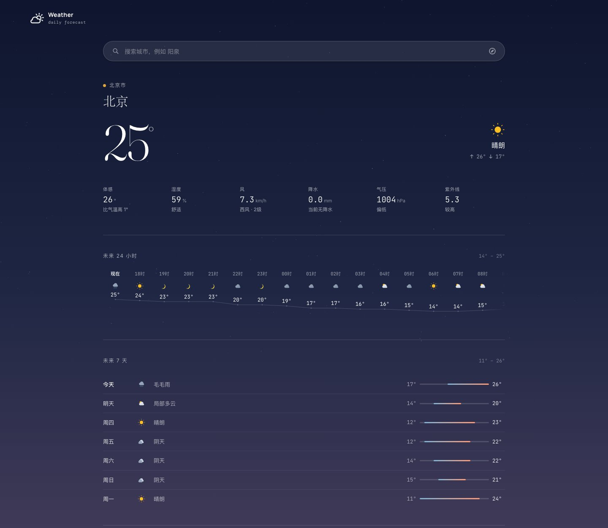
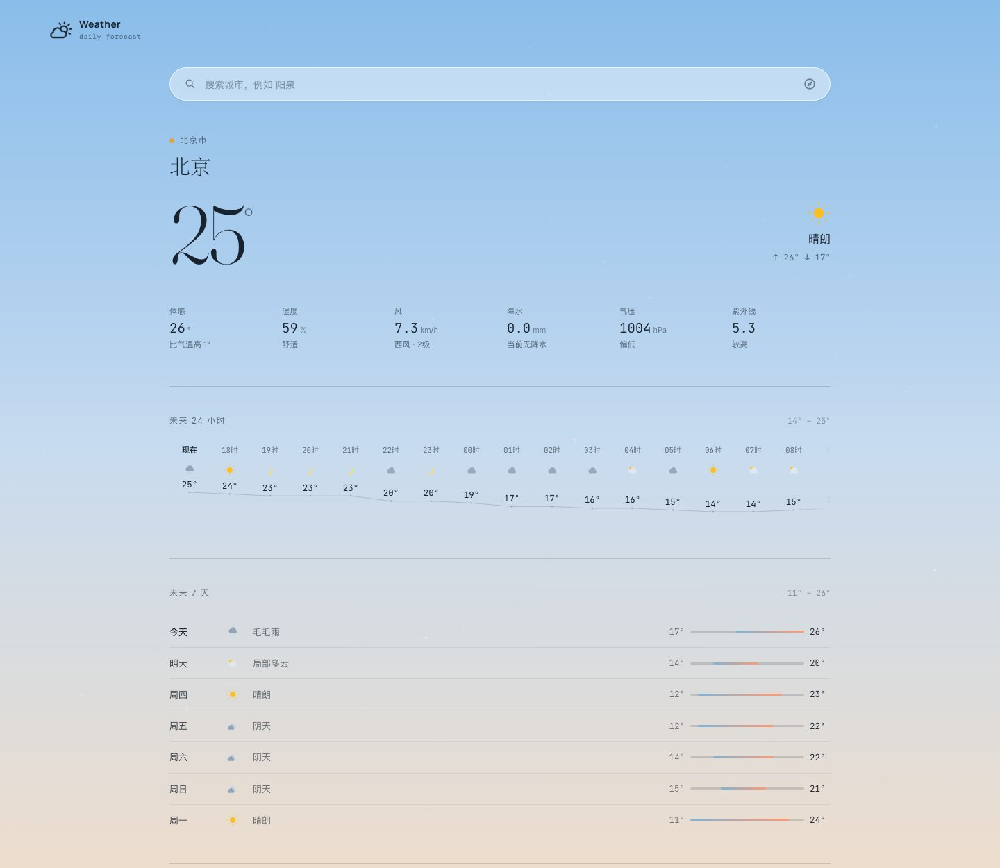
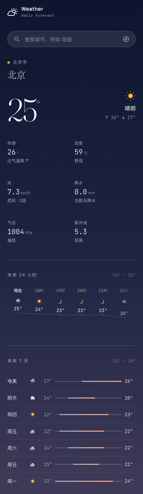
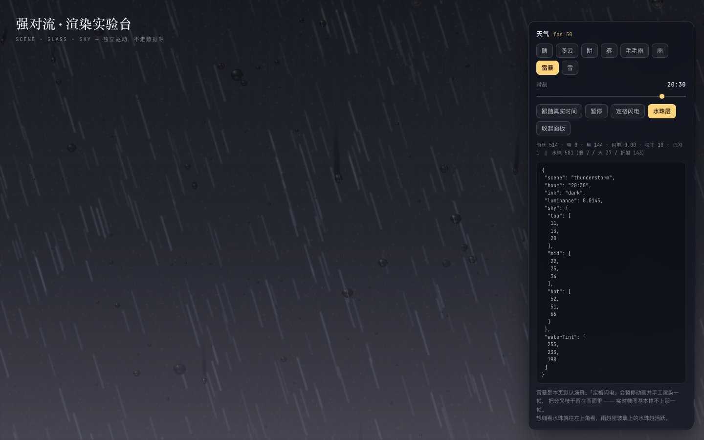
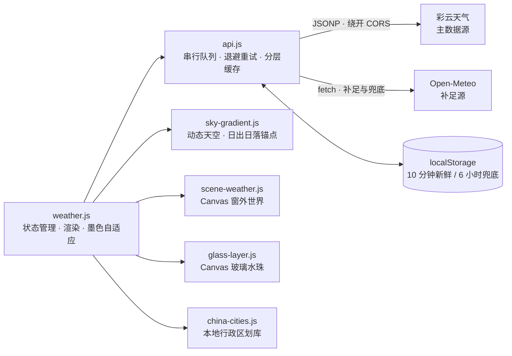

<div align="center">

# AeroWeather

**彩云天气数据驱动的天气看板 · 零构建 / 零依赖的纯静态站点**

三层 Canvas 渲染的「窗外世界」—— 动态天空、雨雪闪电、玻璃水珠，全部逐帧绘制。

[](https://weather.abobb.com)
[](#快速开始)
[](#技术架构)

[在线体验](https://weather.abobb.com) · [核心特性](#核心特性) · [界面一览](#界面一览) · [技术架构](#技术架构) · [快速开始](#快速开始)

</div>



---

## 目录

- [核心特性](#核心特性)
- [界面一览](#界面一览)
  - [主看板](#主看板)
  - [八种天气](#八种天气)
  - [强对流实验台](#强对流实验台)
- [技术架构](#技术架构)
  - [三层 Canvas 渲染](#三层-canvas-渲染)
  - [数据源分层](#数据源分层)
  - [城市检索：本地优先 + 在线兜底](#城市检索本地优先--在线兜底)
- [快速开始](#快速开始)
- [部署](#部署)
- [项目结构](#项目结构)
- [实现要点](#实现要点)
- [更新日志](#更新日志)

---

## 核心特性

| | 特性 | 说明 |
|---|---|---|
| 🌤 | **实时天气** | 气温、体感、最高/最低温、相对湿度、风向风速（蒲福风级）、降水量、地面气压 |
| 🌫 | **空气质量** | PM2.5 / PM10 浓度与国标分级，带「优 → 严重」六段渐变刻度带，游标按位置在渐变线上取色 |
| 🕐 | **逐时与多日预报** | 24 小时气温走势（墨色自适应图标）；7 天预报含比例温差动态条 |
| 🎨 | **三层 Canvas 渲染** | 天空渐变 → 窗外世界（雨雪/闪电/雾霾/星空）→ 近景玻璃水珠，见[下文](#三层-canvas-渲染) |
| 🌅 | **真实日出日落** | 黎明与黄昏的天空分段锚点绑定定位地点的当日日出日落时刻，随地点动态变化 |
| 🏙 | **全国城市检索** | 内置 34 省 / 363 市 / 2855 区县行政区划库（含中心点坐标），离线秒回；支持简繁字形变体 |
| 🧪 | **强对流实验台** | 独立页面 `storm.html`：8 种天气场景 × 任意时刻自由组合，定格闪电、粒子计数与 fps 实时显示 |
| 🌙 | **墨色自适应** | 文字、图标按天空亮度自动切换深浅墨色，任何时刻都可读 |
| 📱 | **响应式** | 手机 / 平板 / 桌面自适应布局，同一套代码 |

## 界面一览

> 截图全部取自线上运行版本。主看板的天空时刻由内置调试接口 `window.__skyTime(h)` 固定，
> 天气与温度是当日真实数据；**八种天气**在[强对流实验台](https://weather.abobb.com/storm.html)
> 上取景 —— 实验台与主站共用同一套渲染引擎（`sky-gradient` / `scene-weather` / `glass-layer`），
> 收起面板后即为纯天气画面，是「各种天气长什么样」最直接的来源。

### 主看板

**白天** —— 温度、六项实况指标、24 小时逐时曲线与 7 天预报（含比例温差条）。



**夜间** —— 天空亮度同时驱动卡片透明度、文字墨色与水珠采光，整页随时刻协调重算。


<div align="center">

**移动端** —— 同一套代码在 390px 视口下的自适应布局。



</div>

### 八种天气

天空按天气调制（压暗 / 去饱和 / 染色），降水、闪电与玻璃水珠各自独立绘制。
下面八张全部取同一时刻（19:00），便于横向比较天色差异：

<table>
  <tr>
    <td align="center" width="50%">
      <br>
      <b>晴</b> —— 星空可见，天色最亮
    </td>
    <td align="center" width="50%">
      <br>
      <b>多云</b> —— 云量抬升，天色压暗去饱和
    </td>
  </tr>
  <tr>
    <td align="center" width="50%">
      <br>
      <b>阴</b> —— 星空隐去，天色压到最沉
    </td>
    <td align="center" width="50%">
      <br>
      <b>雾</b> —— 霾把天色洗淡，地平线层次发灰
    </td>
  </tr>
  <tr>
    <td align="center" width="50%">
      <br>
      <b>毛毛雨</b> —— 雨丝稀疏，玻璃上水珠初起
    </td>
    <td align="center" width="50%">
      <br>
      <b>雨</b> —— 雨丝密集斜落，水珠活跃
    </td>
  </tr>
  <tr>
    <td align="center" width="50%">
      <br>
      <b>雷暴</b> —— 雨最密、天色最暗，分叉闪电（定格帧）
    </td>
    <td align="center" width="50%">
      <br>
      <b>雪</b> —— 片状慢落，密度与雨相当
    </td>
  </tr>
</table>

### 强对流实验台

独立页面 `storm.html`：八种天气 × 任意时刻自由组合，右侧面板给出场景、粒子计数与实时 fps，
并支持跟随真实时间、暂停、**定格闪电**（暂停动画后手工渲染一帧，把分叉枝干留在画面里）
与水珠层开关。



---

## 技术架构



整套前端由**原生 ES Module** 组成，不使用任何框架与打包工具，仓库根目录即部署产物。

### 三层 Canvas 渲染

视觉系统从后到前分三层，各自独立、互不感知：

| 层 | 文件 | 内容 |
|---|---|---|
| 天空渐变 | `sky-gradient.js` | 按小时插值的全屏渐变，按天气调制（压暗 / 去饱和 / 染色）；黎明黄昏分段锚点绑定当地真实日出日落 |
| 窗外世界 | `scene-weather.js` | 地平线暖光带、星空、雨雪粒子、闪电（逐帧状态机，三层描边分叉） |
| 玻璃水珠 | `glass-layer.js` | 近景水珠：浸润圈、透镜体、高光、投影与滑落水痕，六层结构烘进 24 枚精灵 |

天空亮度同时驱动**墨色切换**（`data-ink="light|dark"`）与**水珠采光**（夜间走路灯色温补偿），三层与排版因此始终协调。

### 数据源分层

| 层级 | 数据源 | 职责 |
|---|---|---|
| 主源 | **彩云天气 Caiyun** | 实时天气、24 小时逐时、空气质量（PM2.5 / PM10 / 国标 AQI）、一句话预报、未来 3 天与日出日落 |
| 补足源 | **Open-Meteo** | 补齐彩云试用版只给 3 天的第 4~7 天日预报；紫外线指数**一律以本源为准** |

彩云接口不带 CORS 头，走官方 **JSONP 形态**直连（无需后端）；串行队列 + 指数退避应对 429 限流，10 分钟新鲜缓存 + 6 小时兜底缓存。数据链路有 6 秒总预算，超时立即整体切换 Open-Meteo，页脚始终标注本次实际使用的数据源。

### 城市检索：本地优先 + 在线兜底

- **本地行政区划库**（`assets/china-cities.json`，34 省 / 363 市 / 2855 区县，含中心点坐标）首次搜索懒加载、空闲预热；剥离「市 / 区 / 新区」等通名后缀后评分匹配，离线秒回。
- 在线兜底走 Open-Meteo geocoding，**并发查询简繁多个字形变体**再按人口降序（GeoNames 中文别名简繁混杂，「东京」必须查「東京」）。

---

## 快速开始

本项目是**零构建的纯静态站点** —— 不需要 `npm install`、不需要打包工具，任何静态服务器都能直接跑。

```bash
# 1) 配置彩云 Token（可选；不配则自动走 Open-Meteo 兜底）
cp js/config.example.js js/config.local.js
# 然后编辑 js/config.local.js，把 YOUR_CAIYUN_TOKEN 换成自己的 Token
# 申请入口：https://dashboard.caiyunapp.com/

# 2) 起一个静态服务器
python3 -m http.server 8000
```

浏览器打开 [http://localhost:8000](http://localhost:8000) 即可，根路径会直接渲染天气页。

> **两点注意**
> 1. **必须走 http（或 https）访问，不要用 `file://` 直接打开** —— 项目用 ES Module，`file://` 协议下会被 CORS 拦下。
> 2. `js/config.local.js` 已在 `.gitignore` 中，**不会入库**。仓库只提供模板 `js/config.example.js`；不配 Token 时页面自动降级到 Open-Meteo 免 Key 数据源，功能不受影响。

另有一个独立实验台页面 [storm.html](https://weather.abobb.com/storm.html)：8 种天气场景 × 任意时刻自由组合，支持定格闪电与水珠层开关，用于单独调校强对流视觉效果。

---

## 部署

纯静态产物，Vercel / Cloudflare Pages / GitHub Pages 均可直接托管，**无需任何后端或代理**：

| 平台 | 配置 |
|---|---|
| **Vercel** | Framework Preset 选 `Other`，Build Command 与 Output Directory 全部留空 |
| **Cloudflare Pages** | 构建命令留空，输出目录填 `/` |
| **GitHub Pages** | Settings → Pages → Source 选分支根目录 |

> ⚠️ **使用 Git 集成自动部署时需注意 Token**：`js/config.local.js` 不在仓库中，平台从 GitHub 拉取代码构建时不会有这个文件。两种解法：
> 1. 手动部署本地目录，把配置好 Token 的 `config.local.js` 一并上传；
> 2. 在平台注入环境变量，并在构建命令中生成该文件：
>    ```bash
>    printf 'window.__CAIYUN_TOKEN__ = "%s";\n' "$CAIYUN_TOKEN" > js/config.local.js
>    ```

---

## 项目结构

```
├── weather.html            # 主页面
├── storm.html              # 强对流实验台（独立页面，不依赖任何数据源）
├── vercel.json             # 根路径 rewrite → weather.html
├── css/
│   ├── weather.css         # 毛玻璃组件体系 · 墨色变量
│   └── sky-gradient.css    # 天空层样式
├── js/
│   ├── weather.js          # 状态管理 · 渲染 · 墨色自适应
│   ├── api.js              # 数据源分层 · JSONP · 缓存
│   ├── sky-gradient.js     # 天空渐变 · 日出日落锚点
│   ├── scene-weather.js    # Canvas 窗外世界（雨雪/闪电/雾霾）
│   ├── glass-layer.js      # Canvas 玻璃水珠（六层精灵化）
│   ├── weather-codes.js    # WMO 编码 → 图标与中文标签
│   ├── china-cities.js     # 本地城市检索匹配
│   ├── zh-variant.js       # 简繁字形变体表
│   ├── storm.js            # 实验台面板逻辑
│   ├── config.example.js   # 彩云 Token 模板（config.local.js 不入库）
├── assets/
│   ├── china-cities.json   # 全国区划库（含中心点，gzip 后 53 KB）
│   └── *.png / *.ico       # logo（墨色遮罩）· favicon
└── docs/screenshots/       # README 展示图：3 张主看板 + 八种天气 + 1 张实验台面板
```

---

## 实现要点

- **JSONP 直连**：彩云接口无 CORS 头，动态注入 `<script>` 绕开同源策略，串行队列保证任意时刻只有一个在途请求。
- **日出日落锚点**：天空的分段边界在运行时按 `report.sun` 动态重排，未注入时回落内置默认值，两态互不干扰。
- **水珠精灵化**：六层不透明度拆成「全屏统一量 × 逐珠量」，前者烘进 24 枚离屏精灵、后者交给 `globalAlpha`，一帧一次 `drawImage` 每珠。
- **闪电状态机**：闪电是逐帧状态（无定时器句柄），分叉用递归生成、三层描边（蓝紫辉光 → 白锐核心 → 紫色余辉），天然无泄漏。
- **墨色自适应**：`<html data-ink>` 由天空亮度驱动，logo 与搜索框图标走 CSS mask + `currentColor`，跟随墨色变色。

---

## 更新日志

见 [CHANGELOG.md](CHANGELOG.md)。当前版本 **v1.0.2**（2026-09-29）。
