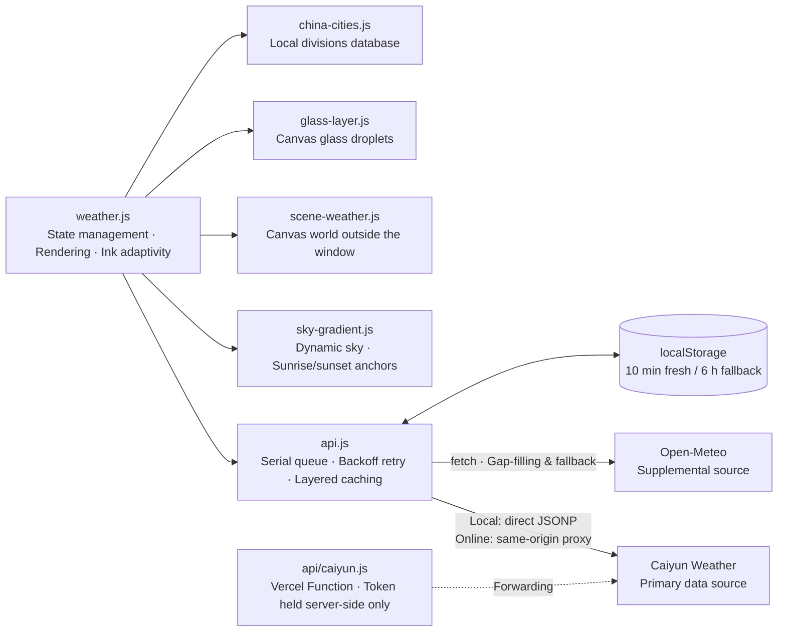
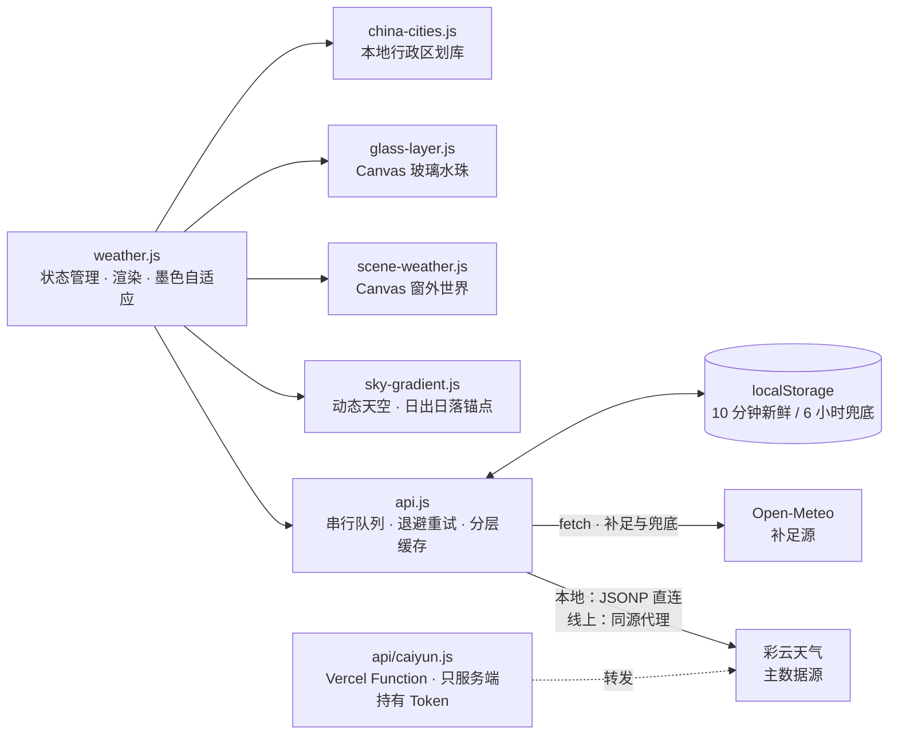

<div align="center">

# AeroWeather

**彩云天气数据驱动的天气看板 · 零构建 / 零依赖的纯静态站点**

三层 Canvas 渲染的「窗外世界」—— 动态天空、雨雪闪电、玻璃水珠，全部逐帧绘制。

[](https://weather.abobb.com)
[](#快速开始)
[](#技术架构)

[在线体验](https://weather.abobb.com) · [核心特性](#核心特性) · [界面一览](#界面一览) · [技术架构](#技术架构) · [快速开始](#快速开始)

</div>

<details>
<summary><b>English</b>（点击展开英文版 · Click to expand）</summary>

<div align="center">

# AeroWeather

**A weather dashboard driven by Caiyun weather data · Zero build / zero dependency, pure static site**

A "world outside the window" rendered with three Canvas layers — dynamic sky, rain/snow/lightning, and glass droplets, all drawn frame by frame.

[](https://weather.abobb.com)
[](#quick-start)
[](#technical-architecture)

[Live Demo](https://weather.abobb.com) · [Core Features](#core-features) · [A Tour of the Interface](#a-tour-of-the-interface) · [Technical Architecture](#technical-architecture) · [Quick Start](#quick-start)

</div>


---

## Table of Contents

- [Core Features](#core-features)
- [A Tour of the Interface](#a-tour-of-the-interface)
  - [Main Dashboard](#main-dashboard)
  - [Eight Weather Scenes](#eight-weather-scenes)
  - [Convection Playground](#convection-playground)
- [Technical Architecture](#technical-architecture)
  - [Three-Layer Canvas Rendering](#three-layer-canvas-rendering)
  - [Data Source Layering](#data-source-layering)
  - [City Search: Local-First + Online Fallback](#city-search-local-first--online-fallback)
- [Quick Start](#quick-start)
- [Deployment](#deployment)
- [Project Structure](#project-structure)
- [Implementation Notes](#implementation-notes)
- [Changelog](#changelog)

---

## Core Features

| | Feature | Description |
|---|---|---|
| 🌤 | **Real-time weather** | Temperature, feels-like, daily high/low, relative humidity, wind direction & speed (Beaufort scale), precipitation, surface pressure |
| 🌫 | **Air quality** | PM2.5 / PM10 concentrations with the Chinese national standard's grading, plus a six-step gradient scale band from "Excellent" to "Severe"; the cursor picks its color from the gradient line based on position |
| 🕐 | **Hourly & multi-day forecast** | 24-hour temperature curve (ink-adaptive icons); 7-day forecast with proportional temperature-range bars |
| 🎨 | **Three-layer Canvas rendering** | Sky gradient → world outside the window (rain/snow/lightning/haze/stars) → near-field glass droplets; see [below](#three-layer-canvas-rendering) |
| 🌅 | **True sunrise/sunset** | The sky's dawn and dusk segment anchors are bound to the actual sunrise/sunset times of the located place, changing dynamically with location |
| 🏙 | **Nationwide city search** | Built-in administrative divisions database of 34 provinces / 363 cities / 2855 districts & counties (with center coordinates), instant offline results; supports simplified/traditional character variants |
| 🧪 | **Convection Playground** | Standalone page `storm.html`: 8 weather scenes × any time of day, freely combinable, with frozen lightning, particle counts, and a live fps display |
| 🌙 | **Ink adaptivity** | Text and icons automatically switch between light and dark ink based on sky brightness — readable at any hour |
| 📱 | **Responsive** | Adaptive layout for phones / tablets / desktops, one and the same codebase |

## A Tour of the Interface

> All screenshots are taken from the live running version. The main dashboard's sky time is pinned via the built-in debug hook `window.__skyTime(h)`;
> the weather and temperature are that day's real data. The **eight weather scenes** were captured on the
> [Convection Playground](https://weather.abobb.com/storm.html) — the playground and the main site share the same rendering engine
> (`sky-gradient` / `scene-weather` / `glass-layer`). Collapse the control panel and you get a pure weather view, which makes it the most direct source for "what each weather looks like".

### Main Dashboard

**Daytime** — temperature, six live metrics, the 24-hour hourly curve and the 7-day forecast (with proportional temperature-range bars).


**Night** — sky brightness simultaneously drives card opacity, text ink, and droplet lighting; the whole page is recomputed coherently with the hour.


<div align="center">

**Mobile** — the same codebase's adaptive layout at a 390px viewport.


</div>

### Eight Weather Scenes

The sky is modulated by the weather (darkened / desaturated / tinted); precipitation, lightning, and glass droplets are each drawn independently.
All eight shots below are from the same moment (19:00), making the sky-color differences easy to compare side by side:

<table>
  <tr>
    <td align="center" width="50%">
      <br>
      <b>Clear</b> — stars visible, brightest sky
    </td>
    <td align="center" width="50%">
      <br>
      <b>Cloudy</b> — cloud cover lifts, sky darkens and desaturates
    </td>
  </tr>
  <tr>
    <td align="center" width="50%">
      <br>
      <b>Overcast</b> — stars fade out, sky pressed to its heaviest
    </td>
    <td align="center" width="50%">
      <br>
      <b>Fog</b> — haze washes the sky pale, horizon layers turn gray
    </td>
  </tr>
  <tr>
    <td align="center" width="50%">
      <br>
      <b>Drizzle</b> — sparse rain streaks, first droplets appear on the glass
    </td>
    <td align="center" width="50%">
      <br>
      <b>Rain</b> — dense, slanting rain streaks, droplets active
    </td>
  </tr>
  <tr>
    <td align="center" width="50%">
      <br>
      <b>Thunderstorm</b> — densest rain, darkest sky, forked lightning (frozen frame)
    </td>
    <td align="center" width="50%">
      <br>
      <b>Snow</b> — flaky and slow-falling, density on par with rain
    </td>
  </tr>
</table>

### Convection Playground

A standalone page `storm.html`: eight weather scenes × any time of day, freely combinable. The panel on the right shows the scene, particle counts, and real-time fps,
and supports following real time, pausing, **freezing lightning** (after pausing the animation, manually render one frame to leave the forked branches in the picture),
and a glass-droplet layer toggle.


---

## Technical Architecture



The entire frontend consists of **native ES Modules** — no frameworks, no bundlers. The repository root is the deployable artifact.

### Three-Layer Canvas Rendering

The visual system is split into three layers from back to front, each independent and unaware of the others:

| Layer | File | Content |
|---|---|---|
| Sky gradient | `sky-gradient.js` | Full-screen gradient interpolated by hour, modulated by weather (darkened / desaturated / tinted); dawn and dusk segment anchors bound to the location's real sunrise/sunset |
| World outside the window | `scene-weather.js` | Horizon warm-light band, star field, rain/snow particles, lightning (per-frame state machine, forked with three-layer strokes) |
| Glass droplets | `glass-layer.js` | Near-field droplets: wetting rings, lens bodies, highlights, drop shadows, and sliding trails — six-layer structure baked into 24 sprites |

Sky brightness simultaneously drives **ink switching** (`data-ink="light|dark"`) and **droplet lighting** (streetlight-color-temperature compensation at night), so the three layers and the typography always stay in harmony.

### Data Source Layering

| Tier | Source | Role |
|---|---|---|
| Primary | **Caiyun Weather** | Real-time weather, 24-hour hourly, air quality (PM2.5 / PM10 / national AQI), one-line forecast, next 3 days, and sunrise/sunset |
| Supplemental | **Open-Meteo** | Fills in daily forecasts for days 4–7, which the Caiyun trial tier limits to 3 days; UV index **always defers to this source** |

The Caiyun API doesn't send CORS headers: **local development** connects directly via the official **JSONP form**; **online** requests go through the same-origin Serverless proxy `api/caiyun.js` — a pure static site cannot hide a secret, so the Token lives only in the deployment platform's environment variables (`CAIYUN_TOKEN`), with not a single byte in any static file. The proxy has a whitelist for request paths, so it can't become an open proxy.

A serial queue + exponential backoff handles 429 rate limiting; a 10-minute fresh cache plus a 6-hour fallback cache. The data pipeline has a 6-second total budget — on timeout it switches to Open-Meteo wholesale, and the footer always labels which data source was actually used for this load.

### City Search: Local-First + Online Fallback

- **Local divisions database** (`assets/china-cities.json`, 34 provinces / 363 cities / 2855 districts & counties, with center coordinates) is lazily loaded on first search and prewarmed during idle time; after stripping generic suffixes like "市 / 区 / 新区" (city / district / new district), it scores matches and returns instantly offline.
- The online fallback uses Open-Meteo geocoding, **querying multiple simplified/traditional character variants in parallel**, then sorts by population descending (GeoNames' Chinese aliases mix simplified and traditional — "东京" (Tokyo) must be searched as "東京").

---

## Quick Start

This project is a **zero-build pure static site** — no `npm install`, no bundler; any static server can run it directly.

```bash
# 1) Configure the Caiyun token (optional · only affects local development; online uses environment variables, see "Deployment")
cp js/config.example.js js/config.local.js
# Then edit js/config.local.js and replace YOUR_CAIYUN_TOKEN with your own token
# Application portal: https://dashboard.caiyunapp.com/

# 2) Start a static server
python3 -m http.server 8000
```

Open [http://localhost:8000](http://localhost:8000) in your browser — the root path renders the weather page directly.

> **Two things to note**
> 1. **You must access it over http (or https), not by opening it directly with `file://`** — the project uses ES Modules, and under the `file://` protocol they get blocked by CORS.
> 2. `js/config.local.js` is listed in both `.gitignore` and `.vercelignore`, so it is **neither committed nor deployed**. The repository only ships the template `js/config.example.js`; if no Token is configured, the page automatically falls back to the key-free Open-Meteo data source, with no loss of functionality.

There is also a standalone playground page, [storm.html](https://weather.abobb.com/storm.html): 8 weather scenes × any time of day, freely combinable, with lightning freezing and a droplet-layer toggle — for tuning the severe-convection visuals on their own.

---

## Deployment

A pure static artifact, hostable directly on Vercel / Cloudflare Pages / GitHub Pages. No backend is needed at all, except for the Caiyun data source; to use Caiyun online, you need one small forwarding function (see below):

| Platform | Configuration |
|---|---|
| **Vercel** | Choose `Other` as Framework Preset; leave both Build Command and Output Directory empty |
| **Cloudflare Pages** | Leave the build command empty; set the output directory to `/` |
| **GitHub Pages** | Settings → Pages → Source: select the branch root directory |

> **How to configure the online Caiyun data source?**
>
> `js/config.local.js` is not in the repository, so when the platform pulls from GitHub to build, this file won't exist — and that is **exactly the desired outcome**. Every file in a pure static site is publicly downloadable; putting the Token in one amounts to publishing it (this very project once leaked its token this way for three days).
>
> Online, a same-origin proxy `api/caiyun.js` is used instead: Vercel automatically compiles files under the root `api/` directory into Serverless Functions. The Token lives in environment variables, with not a single byte in any static file.
>
> ```bash
> vercel env add CAIYUN_TOKEN production   # Paste the token; it takes effect after redeploying
> ```
>
> The frontend only talks to the same-origin `/api/caiyun`, so the public internet never sees the Token; rotating the Token later only touches environment variables, never the code. On other platforms (Cloudflare Workers / Pages Functions), just port those 40 lines of forwarding logic — but **do not go back** to the old way of embedding the Token in a static file.
>
> It also runs without any configuration: the page automatically falls back to the key-free Open-Meteo data source, and the footer honestly labels the source actually used for that load.

---

## Project Structure

```
├── weather.html            # Main page
├── storm.html              # Convection playground (standalone page, depends on no data source)
├── vercel.json             # Root path rewrite → weather.html
├── api/
│   └── caiyun.js           # Caiyun proxy: Token stored in deployment platform env vars, absent from static files
├── css/
│   ├── weather.css         # Frosted-glass component system · Ink variables
│   └── sky-gradient.css    # Sky layer styles
├── js/
│   ├── weather.js          # State management · Rendering · Ink adaptivity
│   ├── api.js              # Data source layering · Caiyun dual channel · Caching
│   ├── sky-gradient.js     # Sky gradient · Sunrise/sunset anchors
│   ├── scene-weather.js    # Canvas world outside the window (rain/snow/lightning/haze)
│   ├── glass-layer.js      # Canvas glass droplets (six-layer, sprited)
│   ├── weather-codes.js    # WMO codes → icons & Chinese labels
│   ├── china-cities.js     # Local city search & matching
│   ├── zh-variant.js       # Simplified/traditional character variant table
│   ├── storm.js            # Playground panel logic
│   ├── config.example.js   # Caiyun token template (config.local.js is not committed)
├── assets/
│   ├── china-cities.json   # Nationwide divisions database (with center points, 53 KB gzipped)
│   ├── logo-weather.png    # Site wordmark (ink mask)
│   └── favicon.*           # Site icons: svg (preferred) + ico in seven sizes + 16/32/180 png
└── docs/screenshots/       # README imagery: 3 main dashboard shots + eight weather scenes + 1 playground panel
```

---

## Implementation Notes

- **Caiyun dual channel**: the API sends no CORS headers — local development uses JSONP (dynamically injecting `<script>` to bypass the same-origin policy), while online it goes through the same-origin Serverless proxy with the Token stored only in environment variables. The serial queue guarantees there is never more than one in-flight request at any moment.
- **Sunrise/sunset anchors**: the sky's segment boundaries are dynamically rearranged at runtime from `report.sun`; if it isn't injected, they fall back to the built-in defaults, with the two states never interfering.
- **Droplet spriting**: the six-layer opacity is split into "a single fullscreen-level amount × a per-droplet amount" — the former is baked into 24 offscreen sprites, the latter is handed to `globalAlpha`, so a frame is one `drawImage` call per droplet.
- **Lightning state machine**: lightning is a per-frame state (no timer handles); forks are generated recursively with three-layer strokes (blue-violet glow → sharp white core → violet afterglow), naturally leak-free.
- **Ink adaptivity**: `<html data-ink>` is driven by sky brightness; the logo and the search box icons use CSS mask + `currentColor` so they change color along with the ink.

---

## Changelog

See [CHANGELOG.md](CHANGELOG.md). Current version: **v1.0.3** (2026-09-30).
</details>


---

## 目录

- [核心特性](#核心特性)
- [界面一览](#界面一览)
  - [主看板](#主看板)
  - [八种天气](#八种天气)
  - [强对流实验台](#强对流实验台)
- [技术架构](#技术架构)
  - [三层 Canvas 渲染](#三层-canvas-渲染)
  - [数据源分层](#数据源分层)
  - [城市检索：本地优先 + 在线兜底](#城市检索本地优先--在线兜底)
- [快速开始](#快速开始)
- [部署](#部署)
- [项目结构](#项目结构)
- [实现要点](#实现要点)
- [更新日志](#更新日志)

---

## 核心特性

| | 特性 | 说明 |
|---|---|---|
| 🌤 | **实时天气** | 气温、体感、最高/最低温、相对湿度、风向风速（蒲福风级）、降水量、地面气压 |
| 🌫 | **空气质量** | PM2.5 / PM10 浓度与国标分级，带「优 → 严重」六段渐变刻度带，游标按位置在渐变线上取色 |
| 🕐 | **逐时与多日预报** | 24 小时气温走势（墨色自适应图标）；7 天预报含比例温差动态条 |
| 🎨 | **三层 Canvas 渲染** | 天空渐变 → 窗外世界（雨雪/闪电/雾霾/星空）→ 近景玻璃水珠，见[下文](#三层-canvas-渲染) |
| 🌅 | **真实日出日落** | 黎明与黄昏的天空分段锚点绑定定位地点的当日日出日落时刻，随地点动态变化 |
| 🏙 | **全国城市检索** | 内置 34 省 / 363 市 / 2855 区县行政区划库（含中心点坐标），离线秒回；支持简繁字形变体 |
| 🧪 | **强对流实验台** | 独立页面 `storm.html`：8 种天气场景 × 任意时刻自由组合，定格闪电、粒子计数与 fps 实时显示 |
| 🌙 | **墨色自适应** | 文字、图标按天空亮度自动切换深浅墨色，任何时刻都可读 |
| 📱 | **响应式** | 手机 / 平板 / 桌面自适应布局，同一套代码 |

## 界面一览

> 截图全部取自线上运行版本。主看板的天空时刻由内置调试接口 `window.__skyTime(h)` 固定，
> 天气与温度是当日真实数据；**八种天气**在[强对流实验台](https://weather.abobb.com/storm.html)
> 上取景 —— 实验台与主站共用同一套渲染引擎（`sky-gradient` / `scene-weather` / `glass-layer`），
> 收起面板后即为纯天气画面，是「各种天气长什么样」最直接的来源。

### 主看板

**白天** —— 温度、六项实况指标、24 小时逐时曲线与 7 天预报（含比例温差条）。


**夜间** —— 天空亮度同时驱动卡片透明度、文字墨色与水珠采光，整页随时刻协调重算。


<div align="center">

**移动端** —— 同一套代码在 390px 视口下的自适应布局。


</div>

### 八种天气

天空按天气调制（压暗 / 去饱和 / 染色），降水、闪电与玻璃水珠各自独立绘制。
下面八张全部取同一时刻（19:00），便于横向比较天色差异：

<table>
  <tr>
    <td align="center" width="50%">
      <br>
      <b>晴</b> —— 星空可见，天色最亮
    </td>
    <td align="center" width="50%">
      <br>
      <b>多云</b> —— 云量抬升，天色压暗去饱和
    </td>
  </tr>
  <tr>
    <td align="center" width="50%">
      <br>
      <b>阴</b> —— 星空隐去，天色压到最沉
    </td>
    <td align="center" width="50%">
      <br>
      <b>雾</b> —— 霾把天色洗淡，地平线层次发灰
    </td>
  </tr>
  <tr>
    <td align="center" width="50%">
      <br>
      <b>毛毛雨</b> —— 雨丝稀疏，玻璃上水珠初起
    </td>
    <td align="center" width="50%">
      <br>
      <b>雨</b> —— 雨丝密集斜落，水珠活跃
    </td>
  </tr>
  <tr>
    <td align="center" width="50%">
      <br>
      <b>雷暴</b> —— 雨最密、天色最暗，分叉闪电（定格帧）
    </td>
    <td align="center" width="50%">
      <br>
      <b>雪</b> —— 片状慢落，密度与雨相当
    </td>
  </tr>
</table>

### 强对流实验台

独立页面 `storm.html`：八种天气 × 任意时刻自由组合，右侧面板给出场景、粒子计数与实时 fps，
并支持跟随真实时间、暂停、**定格闪电**（暂停动画后手工渲染一帧，把分叉枝干留在画面里）
与水珠层开关。


---

## 技术架构



整套前端由**原生 ES Module** 组成，不使用任何框架与打包工具，仓库根目录即部署产物。

### 三层 Canvas 渲染

视觉系统从后到前分三层，各自独立、互不感知：

| 层 | 文件 | 内容 |
|---|---|---|
| 天空渐变 | `sky-gradient.js` | 按小时插值的全屏渐变，按天气调制（压暗 / 去饱和 / 染色）；黎明黄昏分段锚点绑定当地真实日出日落 |
| 窗外世界 | `scene-weather.js` | 地平线暖光带、星空、雨雪粒子、闪电（逐帧状态机，三层描边分叉） |
| 玻璃水珠 | `glass-layer.js` | 近景水珠：浸润圈、透镜体、高光、投影与滑落水痕，六层结构烘进 24 枚精灵 |

天空亮度同时驱动**墨色切换**（`data-ink="light|dark"`）与**水珠采光**（夜间走路灯色温补偿），三层与排版因此始终协调。

### 数据源分层

| 层级 | 数据源 | 职责 |
|---|---|---|
| 主源 | **彩云天气 Caiyun** | 实时天气、24 小时逐时、空气质量（PM2.5 / PM10 / 国标 AQI）、一句话预报、未来 3 天与日出日落 |
| 补足源 | **Open-Meteo** | 补齐彩云试用版只给 3 天的第 4~7 天日预报；紫外线指数**一律以本源为准** |

彩云接口不带 CORS 头：**本地开发**走官方 **JSONP 形态**直连；**线上**则经同源的 Serverless 代理 `api/caiyun.js` 转发 —— 纯静态站藏不住密钥，Token 只存在部署平台的环境变量里（`CAIYUN_TOKEN`），静态文件里一个字节都没有。代理对请求路径设有白名单，不会变成开放代理。

串行队列 + 指数退避应对 429 限流，10 分钟新鲜缓存 + 6 小时兜底缓存。数据链路有 6 秒总预算，超时立即整体切换 Open-Meteo，页脚始终标注本次实际使用的数据源。

### 城市检索：本地优先 + 在线兜底

- **本地行政区划库**（`assets/china-cities.json`，34 省 / 363 市 / 2855 区县，含中心点坐标）首次搜索懒加载、空闲预热；剥离「市 / 区 / 新区」等通名后缀后评分匹配，离线秒回。
- 在线兜底走 Open-Meteo geocoding，**并发查询简繁多个字形变体**再按人口降序（GeoNames 中文别名简繁混杂，「东京」必须查「東京」）。

---

## 快速开始

本项目是**零构建的纯静态站点** —— 不需要 `npm install`、不需要打包工具，任何静态服务器都能直接跑。

```bash
# 1) 配置彩云 Token（可选 · 只影响本地开发；线上走环境变量，见「部署」）
cp js/config.example.js js/config.local.js
# 然后编辑 js/config.local.js，把 YOUR_CAIYUN_TOKEN 换成自己的 Token
# 申请入口：https://dashboard.caiyunapp.com/

# 2) 起一个静态服务器
python3 -m http.server 8000
```

浏览器打开 [http://localhost:8000](http://localhost:8000) 即可，根路径会直接渲染天气页。

> **两点注意**
> 1. **必须走 http（或 https）访问，不要用 `file://` 直接打开** —— 项目用 ES Module，`file://` 协议下会被 CORS 拦下。
> 2. `js/config.local.js` 已在 `.gitignore` 与 `.vercelignore` 中，**既不入库也不进部署**。仓库只提供模板 `js/config.example.js`；不配 Token 时页面自动降级到 Open-Meteo 免 Key 数据源，功能不受影响。

另有一个独立实验台页面 [storm.html](https://weather.abobb.com/storm.html)：8 种天气场景 × 任意时刻自由组合，支持定格闪电与水珠层开关，用于单独调校强对流视觉效果。

---

## 部署

纯静态产物，Vercel / Cloudflare Pages / GitHub Pages 均可直接托管。除彩云数据源外**无需任何后端**；要在线上使用彩云，则需一个转发小函数（见下）：

| 平台 | 配置 |
|---|---|
| **Vercel** | Framework Preset 选 `Other`，Build Command 与 Output Directory 全部留空 |
| **Cloudflare Pages** | 构建命令留空，输出目录填 `/` |
| **GitHub Pages** | Settings → Pages → Source 选分支根目录 |

> **线上彩云数据源怎么配？**
>
> `js/config.local.js` 不在仓库中，平台从 GitHub 拉取构建时不会有这个文件 —— 这**正是想要的结果**。纯静态站里任何文件都是公网可下载的，把 Token 放进去等于公开它（本项目就曾因此裸奔三天）。
>
> 线上改用同源代理 `api/caiyun.js`：Vercel 会自动把根目录 `api/` 下的文件编译成 Serverless Function，Token 存在环境变量里，静态文件里一个字节都没有。
>
> ```bash
> vercel env add CAIYUN_TOKEN production   # 粘贴 Token，之后重新部署生效
> ```
>
> 前端只跟同源 `/api/caiyun` 说话，公网拿不到 Token；以后换 Token 也只改环境变量，不碰代码。其他平台（Cloudflare Workers / Pages Functions）把那 40 行转发逻辑搬过去即可 —— 但**别退回**「把 Token 写进静态文件」的老路。
>
> 不配也能跑：页面自动降级到 Open-Meteo 免 Key 数据源，页脚会如实标注本次实际使用的源。

---

## 项目结构

```
├── weather.html            # 主页面
├── storm.html              # 强对流实验台（独立页面，不依赖任何数据源）
├── vercel.json             # 根路径 rewrite → weather.html
├── api/
│   └── caiyun.js           # 彩云代理：Token 存部署平台环境变量，静态文件里没有
├── css/
│   ├── weather.css         # 毛玻璃组件体系 · 墨色变量
│   └── sky-gradient.css    # 天空层样式
├── js/
│   ├── weather.js          # 状态管理 · 渲染 · 墨色自适应
│   ├── api.js              # 数据源分层 · 彩云双通道 · 缓存
│   ├── sky-gradient.js     # 天空渐变 · 日出日落锚点
│   ├── scene-weather.js    # Canvas 窗外世界（雨雪/闪电/雾霾）
│   ├── glass-layer.js      # Canvas 玻璃水珠（六层精灵化）
│   ├── weather-codes.js    # WMO 编码 → 图标与中文标签
│   ├── china-cities.js     # 本地城市检索匹配
│   ├── zh-variant.js       # 简繁字形变体表
│   ├── storm.js            # 实验台面板逻辑
│   ├── config.example.js   # 彩云 Token 模板（config.local.js 不入库）
├── assets/
│   ├── china-cities.json   # 全国区划库（含中心点，gzip 后 53 KB）
│   ├── logo-weather.png    # 站名字标（墨色遮罩）
│   └── favicon.*           # 站点图标：svg（优先）+ ico 七档 + 16/32/180 png
└── docs/screenshots/       # README 展示图：3 张主看板 + 八种天气 + 1 张实验台面板
```

---

## 实现要点

- **彩云双通道**：接口无 CORS 头 —— 本地开发用 JSONP（动态注入 `<script>` 绕开同源策略），线上经同源 Serverless 代理转发、Token 只存环境变量。串行队列保证任意时刻只有一个在途请求。
- **日出日落锚点**：天空的分段边界在运行时按 `report.sun` 动态重排，未注入时回落内置默认值，两态互不干扰。
- **水珠精灵化**：六层不透明度拆成「全屏统一量 × 逐珠量」，前者烘进 24 枚离屏精灵、后者交给 `globalAlpha`，一帧一次 `drawImage` 每珠。
- **闪电状态机**：闪电是逐帧状态（无定时器句柄），分叉用递归生成、三层描边（蓝紫辉光 → 白锐核心 → 紫色余辉），天然无泄漏。
- **墨色自适应**：`<html data-ink>` 由天空亮度驱动，logo 与搜索框图标走 CSS mask + `currentColor`，跟随墨色变色。

---

## 更新日志

见 [CHANGELOG.md](CHANGELOG.md)。当前版本 **v1.0.3**（2026-09-30）。
